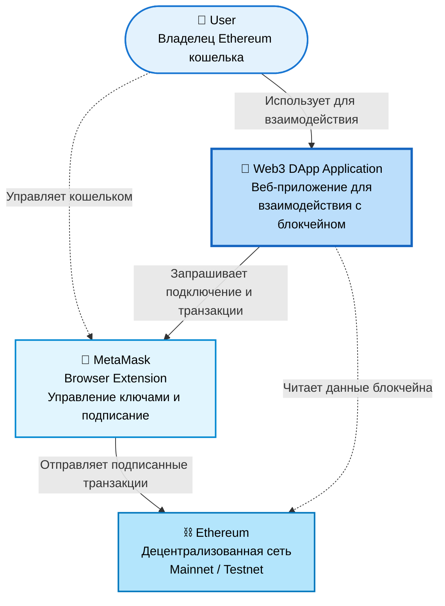

# C4 Level 1: System Context Diagram

> Показывает Web3 DApp в контексте пользователей и внешних систем

**Уровень:** Context (Level 1)

**Аудитория:** Все заинтересованные стороны

**Назначение:** Понять место системы в экосистеме

---

## Диаграмма

---

## Бизнес-контекст

**Проблема:**
Взаимодействие с блокчейном Ethereum требует технических знаний и специализированных инструментов, что создает барьер для обычных пользователей.

**Решение:**
Web3 DApp предоставляет простой и понятный интерфейс для базовых операций с блокчейном: подключение кошелька, просмотр баланса и отправка транзакций.

**Ценность для пользователя:**

- Простой доступ к своим криптоактивам через браузер
- Безопасные транзакции с полным контролем (через MetaMask)
- Прозрачность всех операций

---

## Описание элементов

### 👤 User (Пользователь)

**Тип:** Person

**Роль:** Владелец Ethereum кошелька

**Действия:**

- Открывает Web3 DApp в браузере
- Подключает свой MetaMask кошелек к приложению
- Просматривает баланс ETH
- Отправляет транзакции
- Управляет кошельком через MetaMask расширение

**Технические требования:**

- Современный веб-браузер
- Установленное расширение MetaMask
- ETH для оплаты комиссий сети

---

### 📱 Web3 DApp Application

**Тип:** Software System (Наша система)

**Назначение:**
Веб-приложение для взаимодействия с Ethereum блокчейном через удобный пользовательский интерфейс.

**Функции:**

- Подключение к криптокошельку пользователя
- Отображение баланса и информации о сети
- Отправка ETH транзакций
- Мониторинг статуса транзакций

**Ключевые характеристики:**

- Работает полностью в браузере (не требует установки)
- Не хранит приватные ключи пользователя
- Не имеет backend сервера (stateless)
- Доступно через HTTPS

---

### 🦊 MetaMask

**Тип:** External System (Browser Extension)

**Производитель:** ConsenSys

**Назначение:**
Криптокошелек для безопасного управления приватными ключами и подписания транзакций.

**Функции:**

- Безопасное хранение приватных ключей пользователя
- Управление множественными Ethereum аккаунтами
- Подписание и отправка транзакций
- Переключение между блокчейн сетями
- Предоставление интерфейса для веб-приложений

**Безопасность:**

- Полная изоляция от веб-приложений
- Требует явного подтверждения для каждой операции
- Показывает детали транзакции перед подписанием

---

### ⛓️ Ethereum

**Тип:** External System (Decentralized Network)

**Назначение:**
Децентрализованная блокчейн сеть для хранения и исполнения транзакций.

**Функции:**

- Хранение состояния аккаунтов и балансов
- Обработка и валидация транзакций
- Децентрализованный консенсус
- Предоставление доступа к данным блокчейна

**Доступные сети:**

- **Mainnet** - основная сеть с реальными активами
- **Testnet** (Sepolia) - тестовая сеть для разработки

---

## Взаимодействия

### User → Web3 DApp

Пользователь открывает приложение в браузере и использует его для взаимодействия с блокчейном. Через интерфейс приложения выполняет подключение кошелька, просматривает баланс и отправляет транзакции.

---

### User ↔ MetaMask

Пользователь управляет своими криптоактивами через MetaMask: создает аккаунты, переключается между сетями, подтверждает или отклоняет транзакции, инициированные приложениями.

---

### Web3 DApp → MetaMask

Приложение запрашивает доступ к кошельку пользователя и инициирует транзакции. Все операции требуют явного подтверждения пользователя в MetaMask.

---

### MetaMask → Ethereum

MetaMask отправляет подписанные транзакции в сеть Ethereum и получает данные о состоянии блокчейна (балансы, подтверждения транзакций).

---

### Web3 DApp ⇢ Ethereum

Приложение может читать публичные данные из блокчейна (балансы, информацию о сети). Все операции записи (транзакции) обязательно проходят через MetaMask для обеспечения безопасности.

> **Важно:** Приложение не имеет прямого доступа к приватным ключам - вся криптография выполняется внутри MetaMask.

---

## Границы системы

### Что ВНУТРИ нашей системы

- ✅ Web3 DApp Application
  - Пользовательский интерфейс
  - Бизнес-логика
  - Интеграция с Web3

### Что СНАРУЖИ нашей системы

- ❌ MetaMask (внешняя система для работы с кошельком)
- ❌ Ethereum (распределенная сеть)
- ❌ Браузер (платформа выполнения)
- ❌ Блокчейн инфраструктура (RPC узлы, сетевые провайдеры)

---

## Характеристики системы

### Безопасность

- 🔒 Приложение НЕ хранит приватные ключи
- 🔒 Все транзакции подписываются в MetaMask
- 🔒 Пользователь явно подтверждает каждое действие
- 🔒 Только чтение баланса не требует подписи

### Доступность

- 📱 Работает в любом современном браузере
- 📱 Не требует установки (кроме MetaMask)
- 📱 Доступно через HTTPS
- 📱 Может работать офлайн (после загрузки)

### Масштабируемость

- ⚡ Stateless архитектура (без backend)
- ⚡ Все вычисления на клиенте
- ⚡ Не требует серверных ресурсов
- ⚡ Легко кэшируется CDN

### Зависимости

- 🔗 Требует установленный MetaMask
- 🔗 Требует доступ к Ethereum сети
- 🔗 Зависит от RPC провайдера (через MetaMask)

---

## Use Cases (Пользовательские сценарии)

### UC-1: Подключение кошелька

**Актор:** User

**Предусловия:** MetaMask установлен и настроен

**Основной поток:**

1. Пользователь открывает DApp
2. Видит кнопку "Connect Wallet"
3. Нажимает кнопку
4. MetaMask запрашивает подтверждение
5. Пользователь подтверждает
6. DApp показывает адрес кошелька и баланс

---

### UC-2: Отправка транзакции

**Актор:** User

**Предусловия:** Кошелек подключен, есть ETH для gas

**Основной поток:**

1. Пользователь вводит адрес получателя
2. Вводит сумму ETH
3. Нажимает "Send"
4. MetaMask показывает превью транзакции
5. Пользователь подтверждает
6. Транзакция отправляется в блокчейн
7. DApp показывает статус транзакции

---

### UC-3: Просмотр баланса

**Актор:** User

**Предусловия:** Кошелек подключен

**Основной поток:**

1. Пользователь видит свой баланс в UI
2. Баланс автоматически обновляется после транзакций
3. Может переключить сеть для просмотра баланса на другой сети

---

## Технологические ограничения

### Что может система

- ✅ Подключаться к MetaMask кошельку
- ✅ Отображать баланс и информацию о сети
- ✅ Отправлять ETH транзакции
- ✅ Реагировать на изменения аккаунта/сети
- ✅ Показывать статус транзакций

### Что НЕ может система

- ❌ Работать без MetaMask
- ❌ Хранить приватные ключи
- ❌ Отправлять транзакции без подтверждения пользователя
- ❌ Восстанавливать доступ к кошельку
- ❌ Работать с другими кошельками (только MetaMask в MVP)

---

## Связанные диаграммы

**Следующий уровень детализации:**

- 📄 [Level 2: Container Diagram](./level-2-containers.md) - Внутреннее устройство Web3 DApp

**Последовательности взаимодействий:**

- 📄 [Connect Wallet Flow](../sequences/connect-wallet-flow.md)
- 📄 [Send Transaction Flow](../sequences/send-transaction-flow.md)

**Назад к документации:**

- 📄 [Architecture README](../README.md)

---

**Последнее обновление:** 2025-10-19

**Автор:** Architecture Team

**Статус:** ✅ Актуально
