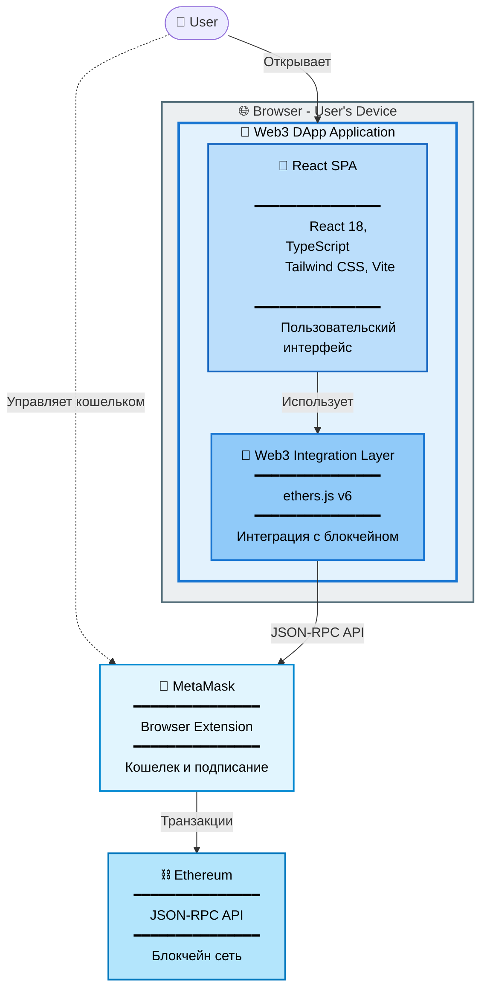

# C4 Level 2: Container Diagram

> Показывает основные технологические контейнеры внутри Web3 DApp

**Уровень:** Container (Level 2)

**Аудитория:** Разработчики, архитекторы

**Назначение:** Понять технологическую структуру системы

---

## Диаграмма



---

## Описание контейнеров

> **Примечание:** React SPA и Web3 Integration Layer показаны как отдельные блоки для визуализации архитектурных слоев и их ответственностей. Физически они компилируются в единый JS bundle и деплоятся вместе как один контейнер.

### 🎨 React SPA (Single Page Application)

**Тип:** Web Application
**Технологии:** React 18, TypeScript, Tailwind CSS, Vite
**Runtime:** Browser JavaScript Engine

#### Ответственность React SPA

**Presentation Layer:**

- Отрисовка пользовательского интерфейса
- Обработка пользовательского ввода
- Управление локальным UI состоянием
- Валидация форм и отображение ошибок

#### Сборка и Deployment

**Build tool:** Vite

- Быстрая разработка с HMR
- Оптимизация бандла
- Tree shaking
- Code splitting

**Output:**

- Статические файлы: HTML, CSS, JS
- Хостинг: GitHub Pages, Vercel, Netlify
- CDN для глобальной доступности

#### Зависимости React SPA

**Runtime:**

- React 18
- React DOM
- TypeScript (compile-time)

**Взаимодействие:**

- → Web3 Integration Layer (через custom hooks)
- ← User interactions (события)

---

### 🔧 Web3 Integration Layer

**Тип:** Library / Service Layer
**Технология:** ethers.js v6
**Паттерн:** Service Layer + Adapter

#### Ответственность Web3 Layer

**Web3 Operations:**

- Управление подключением к кошельку
- Получение баланса и информации о сети
- Обработка транзакций
- Подписка на события MetaMask (смена аккаунта, сети)
- Обработка ошибок и валидация данных

#### Зависимости Web3 Layer

**Внешние:**

- ethers.js v6
- window.ethereum (от MetaMask)

**Взаимодействие:**

- → MetaMask (через window.ethereum)
- ← React SPA (через hooks)

---

### 🦊 MetaMask

**Тип:** External System (Browser Extension)

**API:** EIP-1193 Ethereum Provider

**Interface:** `window.ethereum`

#### Функции

- Безопасное хранение приватных ключей
- Управление множественными аккаунтами
- Подписание транзакций с подтверждением пользователя
- Переключение между блокчейн сетями
- Предоставление `window.ethereum` API для веб-приложений

#### Особенности

- Работает как браузерное расширение
- Использует RPC провайдеры (Infura или custom)
- Требует явного подтверждения всех операций
- Полная изоляция от веб-контента

---

### ⛓️ Ethereum

**Тип:** External System (Blockchain Network)

**Протокол:** JSON-RPC over HTTPS/WSS

**Доступ:** Через MetaMask

#### Предоставляемый API

Ethereum предоставляет JSON-RPC API для взаимодействия с блокчейном:

- **Read операции** (без gas): баланс, информация о блоках, chain ID, gas prices
- **Write операции** (требуют gas): отправка транзакций, оценка gas

#### Сети Ethereum

**Mainnet:**

- Chain ID: 1
- Реальный ETH с ценностью
- Production environment

**Sepolia (Testnet):**

- Chain ID: 11155111
- Тестовый ETH (бесплатный)
- Для разработки и тестирования

#### Доступ к сети

**RPC Провайдеры:**

- Infura (основной)
- Alchemy
- Публичные endpoints

**Ключевые характеристики:**

- Block time: ~12 секунд
- Proof of Stake консенсус
- Finality: ~15 минут

---

## Взаимодействия между контейнерами

### React SPA ↔ Web3 Integration Layer

**Протокол:** JavaScript function calls

**Паттерн:** Observer pattern (через React hooks)

**Data Flow:**

- React → Web3: Вызовы функций (подключение, транзакции)
- Web3 → React: Обновления состояния (через callbacks)

**Преимущества:**

- Разделение ответственности
- Легко тестировать
- Framework-agnostic core логика

---

### Web3 Integration Layer → MetaMask

**Протокол:** EIP-1193 (Ethereum Provider API)

**Transport:** JavaScript API (`window.ethereum`)

**Request Flow:**

1. Web3 Layer создает запрос
2. ethers.js форматирует в JSON-RPC
3. Отправка через `window.ethereum`
4. MetaMask обрабатывает запрос
5. Результат возвращается через Promise

**Типичные операции:**

- Запрос доступа к аккаунтам
- Получение баланса
- Отправка транзакций
- Подписка на события (смена аккаунта, сети)

**Error Handling:**

- User rejection (code: 4001)
- Network errors
- Invalid parameters
- Timeout

---

### MetaMask → Ethereum

**Протокол:** JSON-RPC over HTTPS/WSS

**Провайдер:** Infura / Alchemy / Custom

```text
MetaMask
    ↓ HTTPS
Infura RPC Endpoint
    ↓ P2P
Ethereum Network
```

**Операции:**

- Отправка подписанных транзакций в сеть
- Получение данных о балансах и состоянии
- Подписка на события блокчейна
- Оценка gas fees

---

## Технологический стек

### Frontend Stack

```text
┌─────────────────────────────┐
│    React 18 + TypeScript    │  UI Framework
├─────────────────────────────┤
│      Tailwind CSS           │  Styling
├─────────────────────────────┤
│         Vite                │  Build Tool
├─────────────────────────────┤
│       ethers.js v6          │  Web3 Library
└─────────────────────────────┘
```

### Development Tools

- **TypeScript** - Type safety
- **ESLint** + **Stylelint** - Code quality
- **EditorConfig** - Консистентность кода
- **Git** - Version control

### Build & Deploy

```text
Source Code (TypeScript + React)
        ↓
   Vite Build
        ↓
Static Files (HTML, CSS, JS)
        ↓
   CDN / Static Hosting
        ↓
   User's Browser
```

---

## Deployment Architecture

```mermaid
flowchart LR
    Dev[Developer]
    Git[GitHub Repo]
    CI[GitHub Actions]
    CDN[Vercel / Netlify]
    User[User Browser]

    Dev -->|git push| Git
    Git -->|trigger| CI
    CI -->|build & deploy| CDN
    CDN -->|serve| User

    style Git fill:#eceff1,stroke:#546e7a,stroke-width:2px,color:#000
    style CI fill:#e3f2fd,stroke:#1976d2,stroke-width:2px,color:#000
    style CDN fill:#90caf9,stroke:#1565c0,stroke-width:2px,color:#000
    style Dev fill:#bbdefb,stroke:#1565c0,stroke-width:2px,color:#000
    style User fill:#b3e5fc,stroke:#0277bd,stroke-width:2px,color:#000
```



**Workflow:**

1. Developer pushes code to GitHub
2. GitHub Actions triggers build
3. Vite builds production bundle
4. Deployment to static hosting (Vercel/Netlify)
5. Files served through CDN globally
6. User accesses via HTTPS

**Преимущества:**

- Не требует обслуживания серверов
- Глобальная CDN дистрибуция
- Автоматический HTTPS
- Деплой без простоев
- Возможность отката версий

---

## Безопасность

### Что защищено ✅

- **Приватные ключи** - хранятся только в MetaMask, не в браузере
- **Подтверждение операций** - пользователь явно подтверждает каждую транзакцию
- **HTTPS** - защищенное соединение
- **Stateless** - нет централизованного сервера (точки атаки)
- **Open source** - код доступен для проверки

### Потенциальные риски ⚠️

- **Phishing атаки** - поддельные запросы MetaMask
- **Вредоносные RPC** - если пользователь подключает недоверенный RPC
- **Front-running** - публичный mempool позволяет видеть транзакции
- **Высокие gas fees** - манипуляции с ценой газа

### Меры защиты 🛡️

- **Превью транзакций** - MetaMask показывает все детали
- **Валидация адресов** - проверка формата Ethereum адресов
- **Предупреждения** - для больших сумм и неправильных сетей

---

## Характеристики архитектуры

### Performance

- **Загрузка:** ~500-1000ms (статические файлы через CDN)
- **Web3 операции:** Read ~100-500ms, Write ~15-30s (ожидание подтверждения)
- **Масштабируемость:** Легко через CDN (stateless архитектура)

### Ограничения

- RPC rate limits провайдеров
- Вычисления на клиенте (ограничены браузером)
- Зависимость от доступности MetaMask и Ethereum сети

---

## Связанные диаграммы

**Вверх (меньше деталей):**

- 📄 [Level 1: System Context](./level-1-system-context.md) - Общий контекст

**Вниз (больше деталей):**

- 📄 [Level 3: Component Diagram](./level-3-components.md) - Компоненты внутри React SPA

**Последовательности:**

- 📄 [Connect Wallet Flow](../sequences/connect-wallet-flow.md)
- 📄 [Send Transaction Flow](../sequences/send-transaction-flow.md)

**Назад:**

- 📄 [Architecture README](../README.md)

---

**Последнее обновление:** 2025-10-19

**Автор:** Architecture Team

**Статус:** ✅ Актуально
