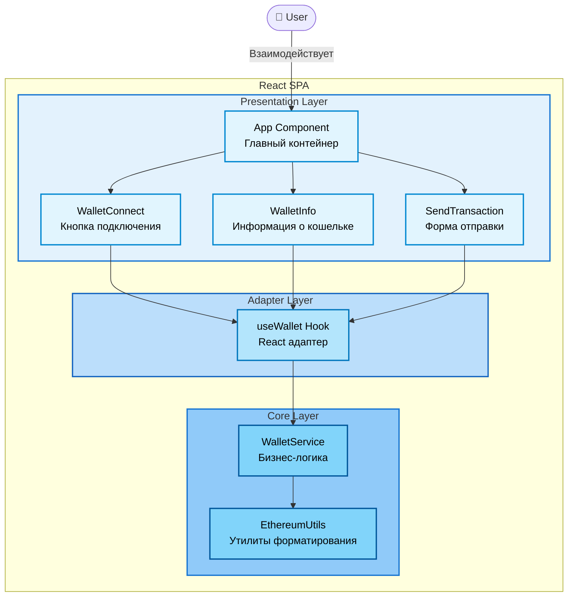

# C4 Level 3: Component Diagram

> Показывает компоненты внутри React SPA и их архитектурные слои

**Уровень:** Component (Level 3)

**Аудитория:** Разработчики

**Назначение:** Понять внутреннюю архитектуру приложения и разделение ответственности

---

## Диаграмма



---

## Архитектурные слои

Приложение построено по принципу **трехслойной архитектуры** с четким разделением ответственности:

### 1. Presentation Layer (Слой представления)

**Назначение:** UI компоненты для взаимодействия с пользователем

**Особенности:**

- React компоненты
- Управляют только UI состоянием
- Не содержат бизнес-логики
- Используют Adapter Layer для доступа к данным

---

### 2. Adapter Layer (Слой адаптации)

**Назначение:** Связывает React компоненты с Core логикой

**Особенности:**

- React hooks
- Паттерн Adapter
- Преобразует Core API в React-friendly интерфейс
- Управляет подпиской на изменения состояния

---

### 3. Core Layer (Слой бизнес-логики)

**Назначение:** Framework-agnostic бизнес-логика

**Особенности:**

- Pure TypeScript (без React)
- Паттерн Service Layer
- Может переиспользоваться в других фреймворках
- Легко тестируется

> **Соответствие Level 2:** В [Container Diagram](./level-2-containers.md) этот слой называется "Web3 Integration Layer" - это технологическая перспектива того же слоя.

---

## Описание компонентов

### Presentation Layer

#### App Component

**Тип:** React Component (контейнер)

**Ответственность:**

- Главный контейнер приложения
- Компоновка UI компонентов
- Управление layout

**Использует:**

- WalletConnect
- WalletInfo
- SendTransaction
- useWallet Hook (для состояния)

---

#### WalletConnect

**Тип:** React Component

**Ответственность:**

- UI для подключения кошелька
- Кнопка "Connect Wallet"
- Отображение loading состояния
- Обработка ошибок подключения

**Использует useWallet:**

- `isConnecting: boolean` - состояние подключения
- `error: Error | null` - ошибки
- `connectWallet()` - метод подключения

---

#### WalletInfo

**Тип:** React Component

**Ответственность:**

- Отображение информации о подключенном кошельке
- Показ адреса, баланса, сети
- Кнопка отключения

**Использует useWallet:**

- `account: string | null` - адрес кошелька
- `balance: string` - баланс
- `chainId: number | null` - ID сети
- `disconnectWallet()` - метод отключения

---

#### SendTransaction

**Тип:** React Component

**Ответственность:**

- Форма отправки транзакций
- Валидация ввода (адрес, сумма)
- Отображение статуса транзакции

**Использует useWallet:**

- `account: string | null` - адрес кошелька
- `balance: string` - текущий баланс
- `sendTransaction(to, amount)` - метод отправки

**Локальное состояние:**

- Recipient address (ввод пользователя)
- Amount (ввод пользователя)
- Transaction status (pending/success/error)
- Validation errors (ошибки формы)

---

### Adapter Layer

#### useWallet Hook

**Тип:** React Custom Hook

**Паттерн:** Adapter Pattern

**Ответственность:**

- Адаптирует WalletService для использования в React
- Управляет подпиской на изменения состояния
- Предоставляет React-friendly API

**Возвращает:**

```typescript
{
  // State
  account: string | null
  balance: string
  chainId: number | null
  isConnecting: boolean
  error: Error | null

  // Methods
  connectWallet: () => Promise<void>
  disconnectWallet: () => void
  sendTransaction: (to, amount) => Promise<string>
}
```

**Реализация:**

- Использует общий экземпляр WalletService (модуль-синглтон)
- Подписывается на изменения через `service.subscribe()`
- Преобразует callback в React state updates
- Очищает подписку при unmount

---

### Core Layer

#### WalletService

**Тип:** TypeScript Class (Service)

**Паттерн:** Service Layer + Observer

**Ответственность:**

- Вся бизнес-логика работы с Web3
- Управление состоянием кошелька
- Взаимодействие с MetaMask через ethers.js
- Уведомление подписчиков об изменениях

**Основные операции:**

- Подключение к кошельку
- Отключение от кошелька
- Отправка транзакций
- Получение баланса
- Обработка событий MetaMask

**Характеристики:**

- Framework-agnostic (pure TypeScript)
- Модуль-синглтон (единый экземпляр для всего приложения)
- Observer паттерн для уведомлений
- Полная инкапсуляция работы с ethers.js

---

#### EthereumUtils

**Тип:** Utility Module

**Ответственность:**

- Утилиты для работы с Ethereum данными
- Форматирование и валидация

**Функции:**

- `formatAddress(address)` - сокращение адреса для UI
- `formatBalance(wei)` - форматирование баланса в ETH
- `getChainName(chainId)` - название сети по ID
- `isValidAddress(address)` - проверка валидности адреса

**Характеристики:**

- Pure functions (без side effects)
- Stateless
- Легко тестируются

---

## Взаимодействия между компонентами

### User → App Component

Пользователь взаимодействует с главным компонентом приложения через UI.

---

### App → UI Components

App Component компонует дочерние компоненты (WalletConnect, WalletInfo, SendTransaction) и передает им данные и обработчики из useWallet Hook.

---

### UI Components → useWallet Hook

Компоненты вызывают методы из hook (connectWallet, disconnectWallet, sendTransaction) и используют состояние (account, balance, isConnecting).

**Паттерн:** Props drilling или Context (на усмотрение реализации)

---

### useWallet Hook → WalletService

Hook создает экземпляр WalletService и подписывается на его изменения. Преобразует callback-based API в React state.

**Паттерн:** Adapter Pattern

**Синхронизация:**

```text
WalletService (state change)
    ↓ notify()
useWallet (callback)
    ↓ setState()
React Components (re-render)
```

---

### WalletService → EthereumUtils

WalletService использует утилиты для форматирования данных перед уведомлением подписчиков.

**Примеры:**

- Форматирование адреса: `0x742d...bEb`
- Форматирование баланса: `1.234 ETH`
- Получение названия сети: `Sepolia Testnet`

---

### WalletService → MetaMask (внешняя система)

WalletService взаимодействует с внешней системой MetaMask через библиотеку ethers.js:

- Инициализация BrowserProvider из `window.ethereum`
- Вызовы методов (requestAccounts, sendTransaction)
- Подписка на события (accountsChanged, chainChanged)

> **Примечание:** MetaMask не является частью React SPA, это внешняя система (browser extension). См. [Level 2: Container Diagram](./level-2-containers.md) для полного контекста взаимодействия.

---

## Архитектурные паттерны

### 1. Layered Architecture (Слоистая архитектура)

**Dependency Rule:** Зависимости идут только вниз

```text
Presentation Layer (React)
        ↓ зависит от
Adapter Layer (Hooks)
        ↓ зависит от
Core Layer (Service)
        ↓ зависит от
Libraries (ethers.js)
```

**Преимущества:**

- Разделение ответственности
- Testability (Core независим от React)
- Переиспользуемость Core в других фреймворках

---

### 2. Observer Pattern

WalletService уведомляет подписчиков об изменениях состояния:

```text
WalletService
    ↓ subscribe()
useWallet Hook
    ↓ setState()
React Components
    ↓ re-render
UI Update
```

**Преимущества:**

- Loose coupling
- Multiple subscribers возможны
- Реактивность

---

### 3. Adapter Pattern

useWallet Hook адаптирует callback-based API WalletService в React hooks API:

```text
WalletService API:
  - subscribe(listener)
  - connect()
  - getState()

useWallet API:
  - { account, balance, ... }
  - connectWallet()
  - (автоматическая подписка)
```

**Преимущества:**

- React компоненты не знают о WalletService
- Легко заменить Core реализацию
- Соответствует React best practices

---

### 4. Service Layer Pattern

WalletService инкапсулирует всю бизнес-логику:

```text
React Components
    ↓ (не знают о Web3)
WalletService
    ↓ (знает о Web3)
ethers.js → MetaMask
```

**Преимущества:**

- Централизованная бизнес-логика
- Единая точка взаимодействия с Web3
- Легко тестировать и модифицировать

---

## Data Flow (Поток данных)

### Connect Wallet Flow (упрощенно)

```text
User clicks "Connect"
    ↓
WalletConnect.onClick()
    ↓
useWallet.connectWallet()
    ↓
WalletService.connect()
    ↓
ethers.js → MetaMask
    ↓
WalletService.notify()
    ↓
useWallet.setState()
    ↓
WalletInfo re-renders
```

> **Детали:** См. [Connect Wallet Flow](../sequences/connect-wallet-flow.md)

---

### State Update Flow

```text
MetaMask (accountsChanged event)
    ↓
WalletService.handleAccountsChanged()
    ↓
WalletService.notify(newState)
    ↓
useWallet.setState(newState)
    ↓
All subscribed components re-render
```

---

## Технологии компонентов

### Технологии Presentation Layer

- **React 18** - UI framework
- **TypeScript** - type safety
- **Tailwind CSS** - styling

### Технологии Adapter Layer

- **React Hooks** - custom hooks API
- **TypeScript** - type safety

### Технологии Core Layer

- **Pure TypeScript** - no framework dependencies
- **ethers.js v6** - Web3 library

---

## Разделение ответственности

### Что делает каждый слой

**Presentation Layer (UI Components):**

- ✅ Отрисовка UI
- ✅ Обработка пользовательского ввода
- ✅ Локальное UI состояние (form data)
- ❌ НЕ содержит бизнес-логику
- ❌ НЕ знает о Web3

**Adapter Layer (useWallet):**

- ✅ Адаптация Core API для React
- ✅ Управление подписками
- ✅ Преобразование callbacks в state
- ❌ НЕ содержит бизнес-логику
- ❌ НЕ знает о ethers.js

**Core Layer (WalletService):**

- ✅ Вся бизнес-логика Web3
- ✅ Управление состоянием кошелька
- ✅ Взаимодействие с ethers.js
- ❌ НЕ знает о React
- ❌ НЕ знает о UI компонентах

---

## Типы данных

### WalletState

```typescript
interface WalletState {
  account: string | null
  balance: string
  chainId: number | null
  isConnecting: boolean
  error: Error | null
}
```

Используется:

- В WalletService (internal state)
- В useWallet (React state)
- В UI Components (props)

---

### TransactionData

```typescript
interface TransactionData {
  to: string
  amount: string
}
```

Используется:

- В SendTransaction (form data)
- В WalletService.sendTransaction()

---

## Границы компонентов

### Что ВНУТРИ React SPA

**Presentation Layer:**

- ✅ App Component
- ✅ WalletConnect Component
- ✅ WalletInfo Component
- ✅ SendTransaction Component

**Adapter Layer:**

- ✅ useWallet Hook

**Core Layer:**

- ✅ WalletService
- ✅ EthereumUtils
- ✅ TypeScript Types/Interfaces

### Что СНАРУЖИ React SPA

**Внешние системы:**

- ❌ MetaMask (browser extension - см. Level 2)
- ❌ Ethereum (blockchain network - см. Level 1, Level 2)

**Библиотеки и фреймворки:**

- ❌ ethers.js v6 (используется Core Layer)
- ❌ React 18 (используется Presentation Layer)
- ❌ Browser API (window.ethereum от MetaMask)

---

## Ключевые решения

### 1. Framework-Agnostic Core

Core Layer (WalletService, Utils) написан на pure TypeScript без зависимостей от React.

**Преимущества:**

- Можно использовать в Vue, Angular, Svelte
- Легко тестировать без React
- Чистая бизнес-логика

**Trade-offs:**

- Дополнительный Adapter Layer
- Чуть больше кода

---

### 2. Single Responsibility

Каждый компонент имеет одну четкую ответственность:

- WalletConnect - только подключение
- WalletInfo - только отображение информации
- SendTransaction - только отправка
- useWallet - только адаптация
- WalletService - только бизнес-логика

**Преимущества:**

- Легко понять и поддерживать
- Легко тестировать
- Легко переиспользовать

---

### 3. Observer Pattern для State Management

WalletService использует Observer pattern вместо внешнего state manager (Redux, MobX).

**Обоснование:**

- Простое приложение - не нужен сложный state manager
- Встроенный механизм подписок
- Меньше зависимостей

**Подходит для:**

- ✅ Небольших и средних приложений
- ✅ Одного основного источника состояния

**Не подходит для:**

- ❌ Сложных приложений с множеством state источников
- ❌ Необходимости time-travel debugging

---

## Связанные диаграммы

**Вверх (меньше деталей):**

- 📄 [Level 2: Container Diagram](./level-2-containers.md) - React SPA как контейнер
- 📄 [Level 1: System Context](./level-1-system-context.md) - Общий контекст системы

**Вниз (больше деталей):**

- 📄 [Level 4: Code Diagram](./level-4-code.md) - Структура классов и интерфейсов

**Последовательности взаимодействий:**

- 📄 [Connect Wallet Flow](../sequences/connect-wallet-flow.md) - Детальный flow подключения
- 📄 [Send Transaction Flow](../sequences/send-transaction-flow.md) - Детальный flow транзакции

**State Diagrams:**

- 📄 [Wallet Connection States](../state-machines/wallet-connection-states.md)
- 📄 [Transaction States](../state-machines/transaction-states.md)

**Назад:**

- 📄 [Architecture README](../README.md)

---

**Последнее обновление:** 2025-10-19

**Автор:** Architecture Team

**Статус:** ✅ Актуально
