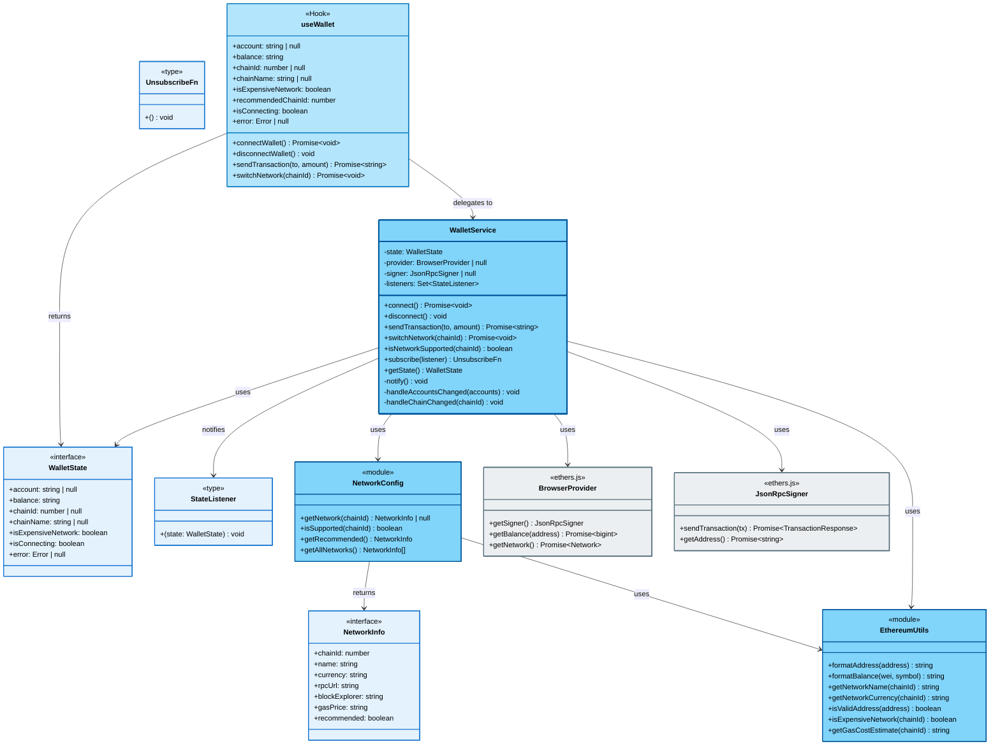

# C4 Level 4: Code Diagram

> Показывает структуру классов, интерфейсов и их взаимосвязи

**Уровень:** Code (Level 4)

**Аудитория:** Разработчики

**Назначение:** Понять структуру кода и детали реализации

> **Область диаграммы:** Level 4 детализирует **Core Layer** (WalletService, EthereumUtils) и **Adapter Layer** (useWallet) из [Level 3](./level-3-components.md). Presentation Layer компоненты (App, WalletConnect, WalletInfo, SendTransaction) имеют простую структуру React компонентов и не требуют отдельной диаграммы классов.

---

## Диаграмма



---

## Описание классов и интерфейсов

### WalletService

**Тип:** TypeScript Class

**Назначение:** Центральный сервис для работы с Web3 кошельком

#### Приватные свойства

- `state: WalletState` - текущее состояние кошелька
- `provider: BrowserProvider | null` - ethers.js провайдер
- `signer: JsonRpcSigner | null` - подписчик транзакций
- `listeners: Set<StateListener>` - подписчики на изменения

#### Публичные методы

##### connect()

Подключает MetaMask кошелек.

**Возвращает:** Promise

**Действия:**

- Запрашивает доступ к аккаунтам
- Получает баланс и сеть
- Устанавливает event listeners
- Уведомляет подписчиков

##### disconnect()

Отключает кошелек.

**Действия:**

- Очищает состояние
- Удаляет event listeners
- Уведомляет подписчиков

##### sendTransaction()

Отправляет транзакцию (ETH или MATIC в зависимости от сети).

**Параметры:** `to: string`, `amount: string`

**Возвращает:** Promise с transaction hash

**Действия:**

- Валидирует входные данные
- Создает транзакцию
- Отправляет через signer
- Ждет подтверждения
- Обновляет баланс

##### switchNetwork()

Переключает blockchain сеть в MetaMask.

**Параметры:** `chainId: number`

**Возвращает:** Promise&lt;void&gt;

**Действия:**

- Получает конфигурацию сети из NetworkConfig
- Пытается переключиться (wallet_switchEthereumChain)
- Если сеть не добавлена (error 4902), добавляет её (wallet_addEthereumChain)
- Обрабатывает ошибки пользователя (отказ)

**Обработка событий:**

```typescript
try {
  await window.ethereum.request({
    method: 'wallet_switchEthereumChain',
    params: [{ chainId: `0x${chainId.toString(16)}` }]
  })
} catch (error) {
  if (error.code === 4902) {
    const network = NetworkConfig.getNetwork(chainId)
    await window.ethereum.request({
      method: 'wallet_addEthereumChain',
      params: [{ chainId: ..., chainName: network.name, ... }]
    })
  }
}
```

##### isNetworkSupported()

Проверяет поддержку сети приложением.

**Параметры:** `chainId: number`

**Возвращает:** boolean

**Реализация:** Делегирует в NetworkConfig.isSupported()

##### subscribe()

Регистрирует подписчика на изменения состояния.

**Параметры:** `listener: StateListener`

**Возвращает:** Функция отписки

##### getState()

Возвращает текущее состояние кошелька.

**Возвращает:** WalletState

#### Приватные методы

##### notify()

Уведомляет всех подписчиков об изменении состояния.

##### handleAccountsChanged()

Обработчик события смены аккаунта от MetaMask.

**Действия:**

- Обновляет account или отключает кошелек
- Уведомляет подписчиков

##### handleChainChanged()

Обработчик события смены сети от MetaMask.

**Действия:**

- Обновляет chainId в состоянии
- Получает информацию о новой сети из NetworkConfig
- Вычисляет chainName через EthereumUtils.getNetworkName()
- Проверяет isExpensiveNetwork через EthereumUtils.isExpensiveNetwork()
- Перезагружает баланс для новой сети (токен может быть другой)
- Уведомляет подписчиков

**Пример:**

```typescript
handleChainChanged(chainId: string) {
  const numericChainId = parseInt(chainId, 16)
  this.state.chainId = numericChainId
  this.state.chainName = EthereumUtils.getNetworkName(numericChainId)
  this.state.isExpensiveNetwork = EthereumUtils.isExpensiveNetwork(numericChainId)
  await this.updateBalance()
  this.notify()
}
```

---

### WalletState

**Тип:** TypeScript Interface

**Назначение:** Описывает состояние кошелька

#### Свойства

- `account: string | null` - адрес подключенного кошелька (null если не подключен)
- `balance: string` - баланс (строка для точности), токен зависит от сети (ETH/MATIC)
- `chainId: number | null` - ID сети (137 = Polygon, 1 = Ethereum, 8453 = Base, 80002 = Amoy, 11155111 = Sepolia)
- `chainName: string | null` - название сети ("Polygon", "Ethereum", "Base", "Amoy Testnet", "Sepolia Testnet")
- `isExpensiveNetwork: boolean` - флаг дорогой сети (true для Ethereum Mainnet)
- `isConnecting: boolean` - флаг процесса подключения
- `error: Error | null` - ошибка (если есть)

**Используется:**

- В WalletService (internal state)
- В useWallet (React state)
- В UI Components (props/destructuring)

---

### StateListener

**Тип:** TypeScript Type Alias

**Определение:**

```typescript
type StateListener = (state: WalletState) => void
```

**Назначение:** Функция обратного вызова для получения обновлений состояния

**Используется:**

- В WalletService.subscribe()
- В useWallet для setState

---

### UnsubscribeFn

**Тип:** TypeScript Type Alias

**Определение:**

```typescript
type UnsubscribeFn = () => void
```

**Назначение:** Функция для отписки от обновлений

**Используется:**

- Возвращается из WalletService.subscribe()
- Вызывается в useEffect cleanup

---

### NetworkConfig

**Тип:** Configuration Module

**Назначение:** Централизованная конфигурация поддерживаемых blockchain сетей

#### Методы

##### getNetwork()

Получает конфигурацию сети по chainId.

**Параметры:** `chainId: number`

**Возвращает:** `NetworkInfo | null`

**Пример:**

```typescript
const network = NetworkConfig.getNetwork(137)
// { chainId: 137, name: "Polygon", currency: "MATIC", ... }
```

##### isSupported()

Проверяет, поддерживается ли сеть приложением.

**Параметры:** `chainId: number`

**Возвращает:** `boolean`

**Пример:**

```typescript
NetworkConfig.isSupported(137)  // true (Polygon)
NetworkConfig.isSupported(999)  // false (неизвестная сеть)
```

##### getRecommended()

Возвращает рекомендуемую сеть (Polygon).

**Возвращает:** `NetworkInfo`

**Пример:**

```typescript
const recommended = NetworkConfig.getRecommended()
// { chainId: 137, name: "Polygon", recommended: true, ... }
```

##### getAllNetworks()

Возвращает список всех поддерживаемых сетей.

**Возвращает:** `NetworkInfo[]`

**Используется:** Для UI выбора сети

**Характеристики:**

- Pure module (без состояния)
- Readonly конфигурация
- Источник истины для поддерживаемых сетей

---

### NetworkInfo

**Тип:** TypeScript Interface

**Назначение:** Описывает конфигурацию одной blockchain сети

#### Свойства

- `chainId: number` - ID сети (137, 1, 8453, 80002, 11155111)
- `name: string` - название ("Polygon", "Ethereum", "Base", etc.)
- `currency: string` - нативный токен ("MATIC", "ETH")
- `rpcUrl: string` - RPC endpoint для подключения
- `blockExplorer: string` - URL block explorer (polygonscan.com, etherscan.io, etc.)
- `gasPrice: string` - примерная стоимость gas ("~$0.001-0.01", "~$5-15")
- `recommended: boolean` - флаг рекомендуемой сети (true только для Polygon)

**Пример объекта:**

```typescript
{
  chainId: 137,
  name: "Polygon",
  currency: "MATIC",
  rpcUrl: "https://polygon-rpc.com",
  blockExplorer: "https://polygonscan.com",
  gasPrice: "~$0.001-0.01",
  recommended: true
}
```

**Используется:**

- В NetworkConfig (хранилище)
- В WalletService.switchNetwork() (параметры для wallet_addEthereumChain)

**Архитектурное решение:** См. [ADR-003: Polygon и multi-chain поддержка](../adrs/003-polygon-and-multichain-support.md)

---

### TransactionData

**Тип:** TypeScript Interface

**Назначение:** Локальный тип для данных формы отправки транзакции

#### Поля

- `to: string` - адрес получателя
- `amount: string` - сумма в ETH

**Используется:**

- В SendTransaction компоненте (form state) - UI Layer

> **Примечание:** Не показан в диаграмме классов, так как используется только в Presentation Layer. WalletService.sendTransaction() принимает эти данные как два отдельных параметра, а не как объект TransactionData.

---

### EthereumUtils

**Тип:** Utility Module

**Назначение:** Утилиты для работы с Ethereum данными

#### Функции

##### formatAddress()

Сокращает адрес для отображения в UI.

**Параметры:** `address: string`

**Возвращает:** string

**Пример:** `0x742d35Cc6634C0532925a3b844Bc9e7595f0bEb` → `0x742d...bEb`

##### formatBalance()

Конвертирует Wei в читаемый формат с токеном.

**Параметры:** `wei: bigint`, `symbol: string`

**Возвращает:** string

**Примеры:**

- `formatBalance(1234567890123456789n, "ETH")` → `1.234 ETH`
- `formatBalance(1234567890123456789n, "MATIC")` → `1.234 MATIC`

##### getNetworkName()

Возвращает название сети по ID.

**Параметры:** `chainId: number`

**Возвращает:** string

**Примеры:**

- `137` → `Polygon`
- `1` → `Ethereum`
- `8453` → `Base`
- `80002` → `Amoy Testnet`
- `11155111` → `Sepolia Testnet`

##### getNetworkCurrency()

Возвращает нативный токен сети.

**Параметры:** `chainId: number`

**Возвращает:** string

**Примеры:**

- `getNetworkCurrency(137)` → `MATIC`
- `getNetworkCurrency(1)` → `ETH`

##### isValidAddress()

Проверяет валидность Ethereum адреса.

**Параметры:** `address: string`

**Возвращает:** boolean

**Реализация:** Использует ethers.js `isAddress()`

**Особенность:** EVM-совместимые адреса имеют одинаковый формат во всех сетях

##### isExpensiveNetwork()

Проверяет, является ли сеть дорогой (высокие gas fees).

**Параметры:** `chainId: number`

**Возвращает:** boolean

**Примеры:**

- `isExpensiveNetwork(1)` → `true` (Ethereum Mainnet)
- `isExpensiveNetwork(137)` → `false` (Polygon)

**Используется:** Для отображения предупреждений в UI

##### getGasCostEstimate()

Возвращает примерную стоимость gas для сети.

**Параметры:** `chainId: number`

**Возвращает:** string

**Примеры:**

- `getGasCostEstimate(137)` → `~$0.001-0.01`
- `getGasCostEstimate(1)` → `~$5-15`

**Используется:** Для информирования пользователя о стоимости

**Особенности:**

- Pure functions (без side effects)
- Stateless
- Не зависят от WalletService

---

### useWallet Hook

**Тип:** React Custom Hook

**Назначение:** React адаптер для WalletService

#### Возвращаемые значения

**State (из WalletService):**

- `account: string | null`
- `balance: string`
- `chainId: number | null`
- `chainName: string | null`
- `isExpensiveNetwork: boolean`
- `recommendedChainId: number` (константа 137 - Polygon)
- `isConnecting: boolean`
- `error: Error | null`

**Methods (делегируют в WalletService):**

- `connectWallet(): Promise<void>`
- `disconnectWallet(): void`
- `sendTransaction(to: string, amount: string): Promise<string>`
- `switchNetwork(chainId: number): Promise<void>`

#### Реализация

**Инициализация:**

```typescript
const service = useMemo(() => walletServiceInstance, [])
const [state, setState] = useState(service.getState())
```

**Подписка:**

```typescript
useEffect(() => {
  const unsubscribe = service.subscribe(setState)
  return unsubscribe
}, [service])
```

**Методы:**

```typescript
const connectWallet = useCallback(
  () => service.connect(),
  [service]
)

const switchNetwork = useCallback(
  (chainId: number) => service.switchNetwork(chainId),
  [service]
)
```

**Вычисляемые значения:**

```typescript
const recommendedChainId = 137  // Polygon
```

---

### BrowserProvider (ethers.js)

**Тип:** External Class (из библиотеки ethers.js)

**Назначение:** Провайдер для взаимодействия с MetaMask

**Ключевые методы:**

- `getSigner()` - получить подписчика транзакций
- `getBalance(address)` - получить баланс адреса
- `getNetwork()` - получить информацию о сети

---

### JsonRpcSigner (ethers.js)

**Тип:** External Class (из библиотеки ethers.js)

**Назначение:** Подписание и отправка транзакций

**Ключевые методы:**

- `sendTransaction(tx)` - отправить транзакцию
- `getAddress()` - получить адрес подписчика

---

## Взаимосвязи

### WalletService → WalletState

**Использование:** WalletService хранит WalletState как приватное свойство

**Тип связи:** Composition (сильная связь)

---

### WalletService → StateListener

**Использование:** WalletService вызывает всех listeners при изменении состояния

**Тип связи:** Dependency (для уведомлений)

---

### WalletService → BrowserProvider / JsonRpcSigner

**Использование:** WalletService использует ethers.js для работы с MetaMask

**Тип связи:** Dependency (библиотечная зависимость)

**Инициализация:**

```typescript
this.provider = new BrowserProvider(window.ethereum)
this.signer = await this.provider.getSigner()
```

---

### WalletService → NetworkConfig

**Использование:** WalletService использует NetworkConfig для получения информации о сетях

**Тип связи:** Dependency (конфигурация)

**Примеры:**

- `switchNetwork()` → `NetworkConfig.getNetwork()`
- `isNetworkSupported()` → `NetworkConfig.isSupported()`
- `connect()` → `NetworkConfig.getRecommended()` (для автопредложения Polygon)

---

### NetworkConfig → NetworkInfo

**Использование:** NetworkConfig возвращает объекты типа NetworkInfo

**Тип связи:** Return type

---

### NetworkConfig → EthereumUtils

**Использование:** NetworkConfig может использовать EthereumUtils для валидации

**Тип связи:** Dependency (опциональная)

---

### WalletService → EthereumUtils

**Использование:** WalletService вызывает utils для форматирования данных

**Тип связи:** Dependency (утилиты)

**Примеры:**

- Форматирование баланса: `EthereumUtils.formatBalance(wei, symbol)`
- Получение названия сети: `EthereumUtils.getNetworkName(chainId)`
- Проверка дорогой сети: `EthereumUtils.isExpensiveNetwork(chainId)`
- Получение токена: `EthereumUtils.getNetworkCurrency(chainId)`

---

### useWallet → WalletService

**Использование:** useWallet делегирует все операции в WalletService

**Тип связи:** Delegation (паттерн Adapter)

**Характер:**

- useWallet НЕ владеет WalletService
- useWallet использует общий экземпляр (модуль-синглтон)

---

### useWallet → WalletState

**Использование:** useWallet возвращает WalletState как часть своего API

**Тип связи:** Return type

---

## Детали реализации

### WalletService State Machine

**Состояния подключения:**

```text
Disconnected → Connecting → Connected
                    ↓
                  Error
```

> **Детали:** См. [Wallet Connection States](../state-machines/wallet-connection-states.md)

---

### Event Listeners

**MetaMask события:**

```typescript
window.ethereum.on('accountsChanged',
  (accounts) => this.handleAccountsChanged(accounts)
)

window.ethereum.on('chainChanged',
  (chainId) => this.handleChainChanged(chainId)
)
```

**Очистка:**

```typescript
window.ethereum.removeListener('accountsChanged', handler)
window.ethereum.removeListener('chainChanged', handler)
```

---

### Transaction Flow

**Последовательность:**

1. Валидация входных данных
2. Создание transaction object
3. Оценка gas (опционально)
4. Отправка через signer
5. Ожидание подтверждения (waitForTransaction)
6. Обновление баланса
7. Уведомление подписчиков

> **Детали:** См. [Send Transaction Flow](../sequences/send-transaction-flow.md)

---

## Типизация

### TypeScript строгая типизация

Все компоненты используют **TypeScript strict mode**:

```typescript
// tsconfig.json
{
  "compilerOptions": {
    "strict": true,
    "noUnusedLocals": true,
    "noUnusedParameters": true,
    "noFallthroughCasesInSwitch": true
  }
}
```

**Преимущества:**

- Compile-time проверка типов
- Автодополнение в IDE
- Refactoring безопасность
- Документация через типы

---

### Null Safety

Все nullable поля явно типизированы:

```typescript
account: string | null  // не string | undefined
error: Error | null
provider: BrowserProvider | null
```

**Правило:** Используем `null` для "отсутствия значения", а не `undefined`

---

## Error Handling

### Типы ошибок

**MetaMaskNotInstalledError:**

- Когда `window.ethereum` отсутствует

**UserRejectedError:**

- Когда пользователь отклонил запрос (code: 4001)

**TransactionError:**

- Ошибки при отправке транзакции

**NetworkError:**

- Проблемы с сетью или RPC

### Обработка в WalletService

```typescript
try {
  await this.provider.send('eth_requestAccounts', [])
} catch (error) {
  if (error.code === 4001) {
    throw new UserRejectedError()
  }
  throw error
}
```

**State при ошибке:**

```typescript
this.state = {
  ...this.state,
  error: error,
  isConnecting: false
}
this.notify()
```

---

## Тестирование

### Unit тесты

**WalletService:**

```typescript
describe('WalletService', () => {
  it('должен подключаться к кошельку', async () => {
    const service = new WalletService()
    await service.connect()
    expect(service.getState().account).toBeTruthy()
  })
})
```

**EthereumUtils:**

```typescript
describe('formatAddress', () => {
  it('должен сокращать адрес', () => {
    const result = formatAddress('0x742d35Cc6634C0532925a3b844Bc9e7595f0bEb')
    expect(result).toBe('0x742d...bEb')
  })
})
```

### Integration тесты

**useWallet Hook:**

```typescript
import { renderHook } from '@testing-library/react'

test('useWallet должен подписываться на WalletService', () => {
  const { result } = renderHook(() => useWallet())
  expect(result.current.account).toBe(null)
})
```

---

## Связанные диаграммы

**Вверх (меньше деталей):**

- 📄 [Level 3: Component Diagram](./level-3-components.md) - Компоненты и архитектурные слои
- 📄 [Level 2: Container Diagram](./level-2-containers.md) - Технологические контейнеры
- 📄 [Level 1: System Context](./level-1-system-context.md) - Общий контекст

**Последовательности:**

- 📄 [Connect Wallet Flow](../sequences/connect-wallet-flow.md) - Детальный поток подключения
- 📄 [Send Transaction Flow](../sequences/send-transaction-flow.md) - Детальный поток транзакции

**State Machines:**

- 📄 [Wallet Connection States](../state-machines/wallet-connection-states.md)
- 📄 [Transaction States](../state-machines/transaction-states.md)

**Архитектурные решения (ADR):**

- 📄 [ADR-001: Использование ethers.js v6](../adrs/001-use-ethers-js-v6.md)
- 📄 [ADR-002: Framework-agnostic архитектура](../adrs/002-framework-agnostic-architecture.md)
- 📄 [ADR-003: Polygon и multi-chain архитектура](../adrs/003-polygon-and-multichain-support.md)

**Назад:**

- 📄 [Architecture README](../README.md)

---

**Последнее обновление:** 2025-10-20

**Автор:** Architecture Team

**Статус:** ✅ Актуально
