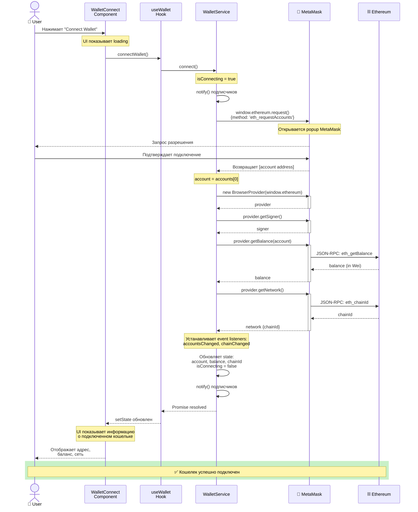

# Sequence Diagram: Connect Wallet Flow

> Диаграмма последовательности подключения MetaMask кошелька

**Тип:** Sequence Diagram

**Сценарий:** Успешное подключение кошелька пользователя

**Участники:** User, WalletConnect Component, useWallet Hook, WalletService, MetaMask, Ethereum

---

## Диаграмма



---

## Описание потока

### Фаза 1: Инициация (User → Service)

**Шаги 1-4:**

1. Пользователь нажимает кнопку "Connect Wallet"
2. WalletConnect component вызывает `connectWallet()` из useWallet hook
3. useWallet делегирует вызов в `WalletService.connect()`
4. WalletService устанавливает `isConnecting = true` и уведомляет подписчиков

**Состояние UI:**

- Кнопка становится disabled
- Показывается loading индикатор
- Текст: "Connecting..."

---

### Фаза 2: Запрос доступа (Service → MetaMask)

**Шаги 5-8:**

1. WalletService вызывает `window.ethereum.request({method: 'eth_requestAccounts'})`
2. MetaMask открывает popup окно
3. Пользователь видит запрос на подключение сайта
4. Пользователь подтверждает доступ

**Детали запроса:**

```typescript
const accounts = await window.ethereum.request({
  method: 'eth_requestAccounts'
})
```

**Возможные действия пользователя:**

- ✅ Approve - переход к следующей фазе
- ❌ Reject - переход к Error Flow
- ⏱️ Timeout (30s) - переход к Error Flow

---

### Фаза 3: Инициализация провайдера (Service → ethers.js)

**Шаги 9-12:**

1. WalletService сохраняет первый аккаунт из ответа
2. Создает `BrowserProvider` из `window.ethereum`
3. Получает `signer` для подписания транзакций
4. Провайдер и signer сохраняются в приватные поля

**Код:**

```typescript
this.provider = new BrowserProvider(window.ethereum)
this.signer = await this.provider.getSigner()
```

**Назначение:**

- `BrowserProvider` - для чтения данных из блокчейна
- `JsonRpcSigner` - для отправки транзакций

---

### Фаза 4: Получение данных о кошельке (Service → Ethereum)

**Шаги 13-18:**

1. WalletService запрашивает баланс через `provider.getBalance()`
2. MetaMask проксирует запрос к Ethereum через RPC
3. Ethereum возвращает баланс в Wei
4. WalletService запрашивает информацию о сети через `provider.getNetwork()`
5. MetaMask проксирует запрос chainId
6. Ethereum возвращает chainId текущей сети

**RPC запросы:**

```text
→ eth_getBalance(address)
← 0x1bc16d674ec80000 (2000000000000000000 Wei = 2 ETH)

→ eth_chainId()
← 0x1 (1 = Ethereum Mainnet)
```

---

### Фаза 5: Установка подписок (Service → MetaMask)

**Шаг 19:**

WalletService устанавливает слушателей событий:

```typescript
window.ethereum.on('accountsChanged', this.handleAccountsChanged)
window.ethereum.on('chainChanged', this.handleChainChanged)
```

**События:**

- `accountsChanged` - пользователь сменил аккаунт в MetaMask
- `chainChanged` - пользователь сменил сеть в MetaMask

**Назначение:**

Автоматическое обновление состояния приложения при изменениях в MetaMask.

---

### Фаза 6: Обновление состояния и UI (Service → UI)

**Шаги 20-24:**

1. WalletService обновляет внутреннее состояние:
    - `account` = адрес кошелька
    - `balance` = баланс в ETH (string)
    - `chainId` = ID сети
    - `isConnecting` = false
    - `error` = null
2. WalletService вызывает `notify()` всех подписчиков
3. useWallet получает обновление через callback
4. useWallet обновляет React state через `setState`
5. React перерисовывает компоненты

**Data Flow:**

```text
WalletService.state → notify() → useWallet.setState() → React Re-render
```

---

### Фаза 7: Отображение результата (UI → User)

**Шаги 25-26:**

1. WalletConnect component скрывается (или показывает кнопку Disconnect)
2. WalletInfo component отображает:
    - Сокращенный адрес (0x1234...5678)
    - Баланс (2.5 ETH)
    - Название сети (Ethereum Mainnet)

**Финальное состояние UI:**

```text
┌─────────────────────────────────┐
│   🦊 Connected                  │
│   0x1234...5678                 │
│   Balance: 2.5 ETH              │
│   Network: Ethereum Mainnet     │
│   [Disconnect]                  │
└─────────────────────────────────┘
```

---

## Временные характеристики

**Типичное время выполнения:**

- User action → MetaMask popup: ~100-300ms
- User approval → Response: зависит от пользователя (1-30s)
- Provider initialization: ~50-100ms
- Balance request: ~200-500ms (RPC call)
- Network request: ~100-300ms (RPC call)
- State update → UI render: ~16-50ms (React)

**Общее время (без пользователя):** ~500ms - 1.5s

**С подтверждением пользователя:** ~2-35s

---

## Error Scenarios

### 1. MetaMask не установлен

```text
Service: if (!window.ethereum)
  → throw Error('MetaMask not installed')
  → WC shows error message
```

### 2. Пользователь отклонил запрос

```text
MetaMask rejection (code 4001)
  → Service catches error
  → state.error = error
  → state.isConnecting = false
  → UI shows "Connection rejected"
```

### 3. Сеть недоступна

```text
RPC timeout
  → Service catches error
  → Shows "Network unavailable"
  → Retry button
```

---

## Состояние до и после

**До подключения:**

```typescript
{
  account: null,
  balance: '0',
  chainId: null,
  isConnecting: false,
  error: null
}
```

**После успешного подключения:**

```typescript
{
  account: '0x742d35Cc6634C0532925a3b844Bc9e7595f0bEb',
  balance: '2.5',
  chainId: 1,
  isConnecting: false,
  error: null
}
```

---

## Связанные диаграммы

**C4 Diagrams:**

- 📄 [Level 3: Component Diagram](../c4-diagrams/level-3-components.md) - Архитектура компонентов
- 📄 [Level 4: Code Diagram](../c4-diagrams/level-4-code.md) - Детали реализации

**State Machines:**

- 📄 [Wallet Connection States](../state-machines/wallet-connection-states.md) - Состояния подключения

**Другие потоки:**

- 📄 [Send Transaction Flow](./send-transaction-flow.md) - Отправка транзакции

> **Примечание:** Disconnect Wallet Flow не требует отдельной диаграммы - это простой вызов `WalletService.disconnect()`, который очищает состояние и удаляет event listeners. См. детали в [Level 4: Code Diagram](../c4-diagrams/level-4-code.md).

**Назад:**

- 📄 [Architecture README](../README.md)

---

**Последнее обновление:** 2025-10-19

**Автор:** Architecture Team

**Статус:** ✅ Актуально
