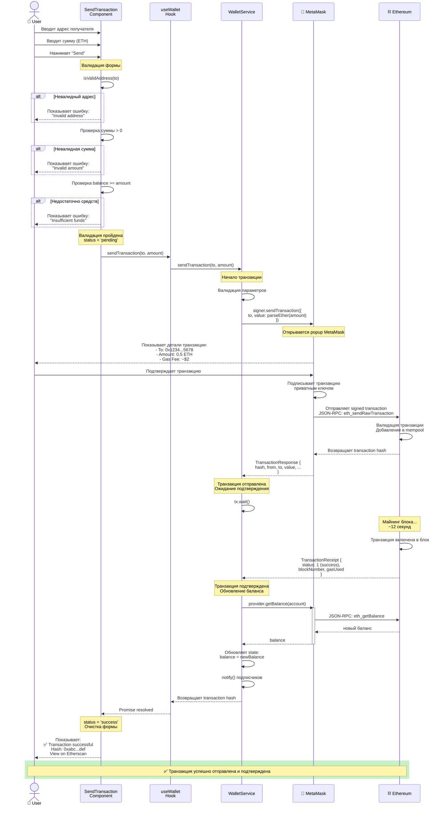

# Sequence Diagram: Send Transaction Flow

> Диаграмма последовательности отправки ETH транзакции

**Тип:** Sequence Diagram

**Сценарий:** Успешная отправка транзакции

**Участники:** User, SendTransaction Component, useWallet Hook, WalletService, MetaMask, Ethereum

---

## Диаграмма



---

## Описание потока

### Фаза 1: Ввод данных (User → UI)

**Шаги 1-3:**

1. Пользователь вводит адрес получателя в input поле
2. Вводит сумму в ETH (например, "0.5")
3. Нажимает кнопку "Send"

**UI компонент:**

```tsx
<form onSubmit={handleSubmit}>
  <input
    type="text"
    placeholder="Recipient address (0x...)"
    value={to}
    onChange={(e) => setTo(e.target.value)}
  />
  <input
    type="number"
    placeholder="Amount (ETH)"
    value={amount}
    onChange={(e) => setAmount(e.target.value)}
  />
  <button type="submit">Send</button>
</form>
```

---

### Фаза 2: Валидация формы (Component)

**Шаги 4-9:**

1. **Проверка адреса получателя:**
   - Вызов `isValidAddress(to)`
   - Проверка формата Ethereum адреса (0x + 40 hex символов)
   - Если невалидно: показывает ошибку, останавливает процесс

2. **Проверка суммы:**
   - Сумма > 0
   - Сумма является числом
   - Если невалидно: показывает ошибку

3. **Проверка баланса:**
   - `balance >= amount`
   - Учитывается gas fee (~0.001 ETH)
   - Если недостаточно: показывает "Insufficient funds"

**Validation код:**

```typescript
if (!isValidAddress(to)) {
  setError('Invalid Ethereum address')
  return
}

if (!amount || Number(amount) <= 0) {
  setError('Amount must be greater than 0')
  return
}

if (Number(balance) < Number(amount)) {
  setError('Insufficient funds')
  return
}

// Валидация пройдена
setStatus('pending')
```

---

### Фаза 3: Делегирование в Service (Component → Service)

**Шаги 10-13:**

1. SendTransaction вызывает `sendTransaction()` из useWallet
2. useWallet делегирует в `WalletService.sendTransaction()`
3. WalletService валидирует параметры еще раз
4. Вызывает `signer.sendTransaction()`

**Параметры транзакции:**

```typescript
const tx = {
  to: to,  // адрес получателя
  value: parseEther(amount)  // сумма в Wei
}
```

**ethers.js автоматически добавляет:**

- `from` - из signer
- `gasLimit` - estimated
- `gasPrice` - current network price
- `nonce` - следующий для этого аккаунта

---

### Фаза 4: Подтверждение пользователем (MetaMask)

**Шаги 14-17:**

1. MetaMask открывает popup окно
2. Показывает детали транзакции:
   - **To:** 0x742d...5678
   - **Amount:** 0.5 ETH (~$1,250)
   - **Gas Fee:** 0.002 ETH (~$5)
   - **Total:** 0.502 ETH (~$1,255)
3. Пользователь проверяет детали
4. Нажимает "Confirm"

**Возможные действия:**

- ✅ Confirm - продолжение
- ❌ Reject - Error Flow (code 4001)
- 🔧 Edit Gas - изменение gas price/limit
- ⏱️ Timeout - Error Flow

---

### Фаза 5: Подписание и отправка (MetaMask → Ethereum)

**Шаги 18-22:**

1. MetaMask подписывает транзакцию приватным ключом пользователя
2. Создает signed transaction (RLP encoded)
3. Отправляет в Ethereum через JSON-RPC: `eth_sendRawTransaction`
4. Ethereum валидирует транзакцию:
   - Корректная подпись
   - Достаточный баланс
   - Валидный nonce
   - Достаточный gas
5. Добавляет в mempool
6. Возвращает transaction hash

**Transaction hash:**

```text
0xabc123def456...
```

Это уникальный идентификатор транзакции, используется для отслеживания.

---

### Фаза 6: Ожидание подтверждения (Service)

**Шаги 23-27:**

1. WalletService получает `TransactionResponse` с hash
2. Вызывает `tx.wait()` для ожидания подтверждения
3. Ethereum включает транзакцию в следующий блок (~12 секунд)
4. Блок добавляется в блокчейн
5. Транзакция считается подтвержденной

**Статусы транзакции:**

```text
Pending → Mined (включена в блок) → Confirmed (N блоков)
```

**wait() параметры:**

```typescript
await tx.wait(1)  // ждать 1 подтверждение (по умолчанию)
// или
await tx.wait(3)  // ждать 3 подтверждения (более надежно)
```

---

### Фаза 7: Обновление баланса (Service → Ethereum)

**Шаги 28-33:**

1. После подтверждения WalletService запрашивает новый баланс
2. Вызывает `provider.getBalance(account)`
3. MetaMask проксирует запрос к Ethereum
4. Ethereum возвращает обновленный баланс
5. WalletService обновляет state
6. Уведомляет всех подписчиков через `notify()`

**Изменение баланса:**

```text
До:   2.5 ETH
Sent: -0.5 ETH
Gas:  -0.002 ETH
-----------------
После: 1.998 ETH
```

---

### Фаза 8: Отображение результата (UI → User)

**Шаги 34-37:**

1. useWallet получает обновленное состояние
2. SendTransaction component обновляется
3. Меняет status с 'pending' на 'success'
4. Показывает сообщение об успехе

**UI после успеха:**

```text
┌────────────────────────────────────┐
│  ✅ Transaction Successful!        │
│                                    │
│  Hash: 0xabc...def                 │
│  Amount: 0.5 ETH                   │
│  To: 0x742d...5678                 │
│                                    │
│  [View on Etherscan]               │
│  [Send Another]                    │
└────────────────────────────────────┘
```

**Ссылка на Etherscan:**

```typescript
const etherscanUrl = `https://etherscan.io/tx/${txHash}`
// или для Sepolia testnet:
const sepoliaUrl = `https://sepolia.etherscan.io/tx/${txHash}`
```

---

## Временные характеристики

**Фаза валидации:** ~10-50ms (локально)

**MetaMask popup:** Зависит от пользователя (2-60s)

**Отправка в mempool:** ~200-500ms

**Включение в блок:** ~12 секунд (среднее время блока)

**Запрос нового баланса:** ~200-500ms

**UI обновление:** ~16-50ms

**Общее время (без пользователя):** ~13-15 секунд

**С пользователем:** ~15-75 секунд

---

## Error Scenarios

### 1. Ошибка валидации

```text
Component: Валидация не пройдена
  → setError('...')
  → status остается 'idle'
  → Форма не отправляется
```

### 2. Пользователь отклонил транзакцию

```text
MetaMask rejection (code 4001)
  → Service catches error
  → Hook catches error
  → Component: status = 'failed'
  → Показывает: "Transaction rejected by user"
```

### 3. Недостаточно gas

```text
Ethereum: Недостаточно ETH для gas
  → TransactionResponse: status = 0 (failed)
  → Service catches error
  → Component: status = 'failed'
  → Показывает: "Insufficient funds for gas"
```

### 4. Транзакция отклонена сетью

```text
Ethereum: Validation failed (nonce, signature, etc.)
  → Ethereum возвращает ошибку
  → Service catches error
  → Component: status = 'failed'
  → Показывает детали ошибки
```

### 5. Network timeout

```text
wait() timeout (нет подтверждения 5 минут)
  → Service catches timeout
  → Component: status = 'pending' (транзакция еще в mempool)
  → Показывает: "Transaction pending, check later"
  → Дает ссылку на Etherscan для отслеживания
```

---

## Transaction States

**В компоненте:**

```typescript
type TxStatus = 'idle' | 'validating' | 'pending' | 'success' | 'failed'

const [status, setStatus] = useState<TxStatus>('idle')
```

**Переходы:**

```text
idle → validating → pending → success
                      ↓
                    failed
```

**idle:** Форма пустая, ожидание ввода

**validating:** Проверка введенных данных

**pending:** Транзакция отправлена, ожидание подтверждения

**success:** Транзакция подтверждена

**failed:** Произошла ошибка на любом этапе

> **Детали:** См. [Transaction States](../state-machines/transaction-states.md)

---

## Transaction Data

**В mempool:**

```json
{
  "hash": "0xabc123...",
  "from": "0x742d35Cc6634C0532925a3b844Bc9e7595f0bEb",
  "to": "0x1234567890123456789012345678901234567890",
  "value": "500000000000000000",  // 0.5 ETH in Wei
  "gasLimit": "21000",
  "gasPrice": "50000000000",  // 50 Gwei
  "nonce": 5,
  "data": "0x"
}
```

**После подтверждения (Receipt):**

```json
{
  "transactionHash": "0xabc123...",
  "blockNumber": 18234567,
  "blockHash": "0xdef456...",
  "status": 1,  // 1 = success, 0 = failed
  "gasUsed": "21000",
  "effectiveGasPrice": "48000000000",
  "from": "0x742d...",
  "to": "0x1234...",
  "logs": []  // пусто для простого перевода ETH
}
```

---

## Gas Fee Calculation

**Формула:**

```text
Gas Fee = gasUsed × effectiveGasPrice
```

**Пример:**

```text
gasUsed = 21,000 (стандарт для ETH transfer)
gasPrice = 50 Gwei = 0.00000005 ETH

Gas Fee = 21,000 × 0.00000005 = 0.00105 ETH (~$2.10)
```

**Total cost:**

```text
Total = amount + gasFee
Total = 0.5 ETH + 0.00105 ETH = 0.50105 ETH
```

---

## Связанные диаграммы

**C4 Diagrams:**

- 📄 [Level 3: Component Diagram](../c4-diagrams/level-3-components.md) - Архитектура компонентов
- 📄 [Level 4: Code Diagram](../c4-diagrams/level-4-code.md) - Детали реализации

**State Machines:**

- 📄 [Transaction States](../state-machines/transaction-states.md) - Состояния транзакции

**Другие потоки:**

- 📄 [Connect Wallet Flow](./connect-wallet-flow.md) - Подключение кошелька

> **Примечание:** Disconnect Wallet Flow не требует отдельной диаграммы - это простой вызов `WalletService.disconnect()`, который очищает состояние и удаляет event listeners. См. детали в [Level 4: Code Diagram](../c4-diagrams/level-4-code.md).

**Назад:**

- 📄 [Architecture README](../README.md)

---

**Последнее обновление:** 2025-10-19

**Автор:** Architecture Team

**Статус:** ✅ Актуально
