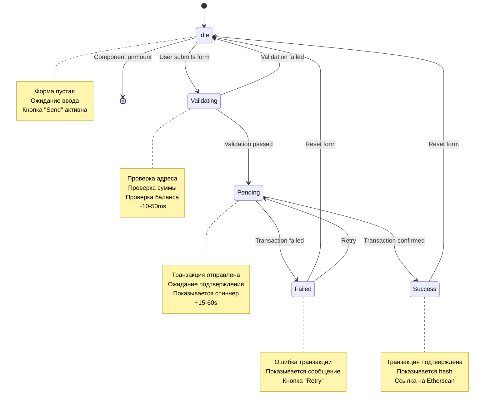

# State Machine: Transaction States

> Диаграмма состояний отправки транзакции

**Тип:** State Machine Diagram

**Компонент:** SendTransaction Component

**Назначение:** Описывает жизненный цикл транзакции от ввода до подтверждения

---

## Диаграмма



---

## Описание состояний

### Idle (Начальное состояние)

**Описание:**

Форма отправки транзакции пустая или готова к новому вводу. Ожидается действие пользователя.

**Component State:**

```typescript
{
  to: '',
  amount: '',
  status: 'idle',
  txHash: null,
  error: null
}
```

**UI:**

- Два input поля (адрес, сумма)
- Кнопка "Send" активна
- Нет сообщений об ошибках
- Нет loading индикаторов

**Возможные переходы:**

- ✅ User submits form → **Validating**
- ✅ Component unmount → **[*]**

---

### Validating (Промежуточное состояние)

**Описание:**

Выполняется валидация введенных данных перед отправкой. Это быстрое синхронное состояние.

**Component State:**

```typescript
{
  to: '0x742d35Cc6634C0532925a3b844Bc9e7595f0bEb',
  amount: '0.5',
  status: 'validating',
  txHash: null,
  error: null
}
```

**Проверки:**

1. **Адрес получателя:**
   - Не пустой
   - Валидный Ethereum адрес (0x + 40 hex символов)
   - Использует `isValidAddress(to)`

2. **Сумма:**
   - Не пустая
   - Число > 0
   - Не больше доступного баланса (с учетом gas)

3. **Баланс:**
   - `balance >= amount + estimatedGas`

**UI:**

- Кнопка "Send" становится disabled
- Может показываться spinner (опционально, т.к. быстро)

**Время в состоянии:** ~10-50ms

**Возможные переходы:**

- ✅ Validation passed → **Pending**
- ❌ Validation failed → **Idle** (с error message)

---

### Pending (Асинхронное состояние)

**Описание:**

Транзакция отправлена в сеть и ожидает подтверждения. Это самое длительное состояние.

**Component State:**

```typescript
{
  to: '0x742d35Cc6634C0532925a3b844Bc9e7595f0bEb',
  amount: '0.5',
  status: 'pending',
  txHash: '0xabc123...',  // получен после отправки
  error: null
}
```

**UI:**

- Показывается loading spinner
- Текст: "Sending transaction..."
- После получения hash: "Transaction sent! Waiting for confirmation..."
- Показывается transaction hash (если есть)
- Кнопка "Send" disabled
- Inputs disabled

**Этапы внутри Pending:**

1. **Awaiting User Approval (в MetaMask):**
   - MetaMask popup открыт
   - Пользователь может подтвердить или отклонить
   - Время: зависит от пользователя (2-60s)

2. **Transaction Sent to Mempool:**
   - Транзакция подписана и отправлена
   - Получен transaction hash
   - Время: ~200-500ms

3. **Waiting for Block Inclusion:**
   - Транзакция в mempool
   - Ожидание майнинга блока
   - Время: ~12 секунд (average block time)

4. **Waiting for Confirmations:**
   - Транзакция включена в блок
   - Ожидание N подтверждений (обычно 1)
   - Время: ~12 секунд × N

**Общее время:** ~15-60 секунд

**Возможные переходы:**

- ✅ Transaction confirmed → **Success**
- ❌ Transaction failed (any reason) → **Failed**

---

### Success (Финальное состояние)

**Описание:**

Транзакция успешно подтверждена в блокчейне. Пользователь получил подтверждение.

**Component State:**

```typescript
{
  to: '0x742d35Cc6634C0532925a3b844Bc9e7595f0bEb',
  amount: '0.5',
  status: 'success',
  txHash: '0xabc123def456...',
  error: null
}
```

**UI:**

- ✅ Зеленое сообщение: "Transaction successful!"
- Показывается transaction hash
- Ссылка "View on Etherscan"
- Кнопка "Send Another" (вызывает reset)

**Детали сообщения:**

```text
✅ Transaction Successful!

Amount: 0.5 ETH
To: 0x742d...5678
Hash: 0xabc1...def6

[View on Etherscan]
[Send Another]
```

**Возможные переходы:**

- ✅ Reset form (Send Another) → **Idle**

---

### Failed (Финальное ошибочное состояние)

**Описание:**

Транзакция не удалась по какой-либо причине. Пользователь получил ошибку.

**Component State:**

```typescript
{
  to: '0x742d35Cc6634C0532925a3b844Bc9e7595f0bEb',
  amount: '0.5',
  status: 'failed',
  txHash: '0xabc123...' | null,  // может быть null если не дошло до отправки
  error: Error('User rejected the request.')
}
```

**Типы ошибок:**

1. **User Rejected (code 4001):**
   - "Transaction rejected by user"
   - hash: null
   - Retry возможен

2. **Insufficient Funds:**
   - "Insufficient funds for gas * price + value"
   - hash: null
   - Retry после пополнения

3. **Gas Estimation Failed:**
   - "Cannot estimate gas"
   - hash: null
   - Может быть проблема с контрактом

4. **Transaction Reverted:**
   - "Transaction has been reverted by the EVM"
   - hash: есть (транзакция в блокчейне, но failed)
   - status в receipt: 0

5. **Network Error:**
   - "Network request failed"
   - hash: null
   - Retry возможен

**UI:**

- ❌ Красное сообщение об ошибке
- Детали ошибки (если есть)
- Кнопка "Try Again" (вызывает retry)
- Кнопка "Cancel" (вызывает reset)
- Если есть hash: ссылка на Etherscan

**Возможные переходы:**

- ✅ Retry → **Pending** (отправка той же транзакции заново)
- ✅ Cancel/Reset → **Idle** (очистка формы)

---

## Переходы между состояниями

### Idle → Validating

**Триггер:** User submits form (нажимает "Send")

**Условие:** Форма заполнена (to и amount не пустые)

**Действия:**

1. Установить `status = 'validating'`
2. Вызвать `handleSubmit()`
3. Запустить validation

**Код:**

```typescript
const handleSubmit = (e: FormEvent) => {
  e.preventDefault()

  setStatus('validating')

  // Валидация...
}
```

---

### Validating → Idle (Validation Failed)

**Триггер:** Validation не пройдена

**Условие:** Любая проверка failed

**Действия:**

1. Установить `status = 'idle'`
2. Установить `error` с сообщением
3. Фокус на невалидное поле (опционально)

**Код:**

```typescript
if (!isValidAddress(to)) {
  setError('Invalid Ethereum address')
  setStatus('idle')
  return
}

if (!amount || Number(amount) <= 0) {
  setError('Amount must be greater than 0')
  setStatus('idle')
  return
}

if (Number(balance) < Number(amount)) {
  setError('Insufficient funds')
  setStatus('idle')
  return
}
```

---

### Validating → Pending (Validation Passed)

**Триггер:** Все проверки пройдены

**Условие:** `isValidAddress(to) && amount > 0 && balance >= amount`

**Действия:**

1. Установить `status = 'pending'`
2. Вызвать `sendTransaction(to, amount)`
3. Показать loading UI

**Код:**

```typescript
// Validation passed
setStatus('pending')
setError(null)

try {
  const hash = await sendTransaction(to, amount)
  setTxHash(hash)
  // Остаемся в pending, пока wait() не завершится
} catch (error) {
  // Переход в Failed
}
```

---

### Pending → Success

**Триггер:** Transaction confirmed

**Условие:** `receipt.status === 1` (success)

**Действия:**

1. Установить `status = 'success'`
2. Сохранить `txHash`
3. Показать success message

**Код:**

```typescript
try {
  const hash = await sendTransaction(to, amount)
  setTxHash(hash)

  // wait() resolves когда транзакция подтверждена
  // WalletService внутренне обновит баланс

  setStatus('success')
} catch (error) {
  setStatus('failed')
  setError(error as Error)
}
```

---

### Pending → Failed

**Триггер:** Transaction failed или error caught

**Условие:** Любая ошибка во время отправки или подтверждения

**Действия:**

1. Установить `status = 'failed'`
2. Сохранить `error` object
3. Сохранить `txHash` (если есть)
4. Показать error message

**Примеры:**

- User rejected в MetaMask
- Insufficient gas
- Transaction reverted
- Network timeout

---

### Success → Idle

**Триггер:** User нажимает "Send Another" или reset

**Условие:** Нет (всегда возможен)

**Действия:**

1. Очистить все поля формы
2. Установить `status = 'idle'`
3. Очистить `txHash` и `error`

**Код:**

```typescript
const resetForm = () => {
  setTo('')
  setAmount('')
  setStatus('idle')
  setTxHash(null)
  setError(null)
}
```

---

### Failed → Idle

**Триггер:** User нажимает "Cancel" или "Dismiss"

**Условие:** Нет

**Действия:**

1. Очистить форму
2. Установить `status = 'idle'`
3. Очистить `error`

---

### Failed → Pending (Retry)

**Триггер:** User нажимает "Try Again"

**Условие:** Форма все еще заполнена теми же данными

**Действия:**

1. Очистить `error`
2. Установить `status = 'pending'`
3. Повторить отправку транзакции с теми же параметрами

**Код:**

```typescript
const handleRetry = async () => {
  setError(null)
  setStatus('pending')

  try {
    const hash = await sendTransaction(to, amount)
    setTxHash(hash)
    setStatus('success')
  } catch (error) {
    setStatus('failed')
    setError(error as Error)
  }
}
```

---

## Инварианты

Правила, которые всегда должны соблюдаться:

### Правило 1: В любой момент времени только одно состояние активно

```typescript
type TxStatus = 'idle' | 'validating' | 'pending' | 'success' | 'failed'
// ONLY ONE at a time
```

### Правило 2: txHash !== null ТОЛЬКО в Success или Failed

```typescript
if (txHash !== null) {
  assert(status === 'success' || status === 'failed')
}
```

### Правило 3: error !== null ТОЛЬКО в Failed

```typescript
if (error !== null) {
  assert(status === 'failed')
}
```

### Правило 4: В Pending НЕЛЬЗЯ изменять to и amount

```typescript
if (status === 'pending') {
  // inputs должны быть disabled
  assert(toInputDisabled === true)
  assert(amountInputDisabled === true)
}
```

### Правило 5: Validating → результат ВСЕГДА за < 100ms

```typescript
// Validating НЕ должен включать async операции
// Только синхронные проверки
```

---

## Тестирование состояний

### Unit Tests

```typescript
describe('SendTransaction State Machine', () => {
  it('starts in Idle state', () => {
    const { result } = renderHook(() => useSendTransaction())
    expect(result.current.status).toBe('idle')
  })

  it('transitions to validating on submit', () => {
    const { result } = renderHook(() => useSendTransaction())

    act(() => {
      result.current.setTo('0x742d...')
      result.current.setAmount('0.5')
      result.current.handleSubmit(mockEvent)
    })

    expect(result.current.status).toBe('validating')
  })

  it('returns to idle on validation failure', () => {
    const { result } = renderHook(() => useSendTransaction())

    act(() => {
      result.current.setTo('invalid')  // невалидный адрес
      result.current.handleSubmit(mockEvent)
    })

    expect(result.current.status).toBe('idle')
    expect(result.current.error).toBeTruthy()
  })

  it('transitions to pending on validation success', async () => {
    const { result } = renderHook(() => useSendTransaction())

    act(() => {
      result.current.setTo('0x742d...')
      result.current.setAmount('0.5')
      result.current.handleSubmit(mockEvent)
    })

    await waitFor(() => {
      expect(result.current.status).toBe('pending')
    })
  })

  it('transitions to success on confirmation', async () => {
    const { result } = renderHook(() => useSendTransaction())

    // mock successful transaction
    mockSendTransaction.mockResolvedValue('0xabc...')

    act(() => {
      result.current.setTo('0x742d...')
      result.current.setAmount('0.5')
      result.current.handleSubmit(mockEvent)
    })

    await waitFor(() => {
      expect(result.current.status).toBe('success')
      expect(result.current.txHash).toBe('0xabc...')
    })
  })

  it('transitions to failed on error', async () => {
    const { result } = renderHook(() => useSendTransaction())

    // mock rejection
    mockSendTransaction.mockRejectedValue(
      new Error('User rejected')
    )

    act(() => {
      result.current.setTo('0x742d...')
      result.current.setAmount('0.5')
      result.current.handleSubmit(mockEvent)
    })

    await waitFor(() => {
      expect(result.current.status).toBe('failed')
      expect(result.current.error).toBeTruthy()
    })
  })
})
```

---

## UI для каждого состояния

### Idle UI

```tsx
{status === 'idle' && (
  <form onSubmit={handleSubmit}>
    <input
      value={to}
      onChange={(e) => setTo(e.target.value)}
      placeholder="Recipient address"
    />
    <input
      value={amount}
      onChange={(e) => setAmount(e.target.value)}
      placeholder="Amount (ETH)"
      type="number"
    />
    <button type="submit">Send</button>
    {error && <div className="error">{error}</div>}
  </form>
)}
```

### Pending UI

```tsx
{status === 'pending' && (
  <div className="pending">
    <Spinner />
    <p>Sending transaction...</p>
    {txHash && (
      <p>
        Transaction sent! Waiting for confirmation...
        <br />
        Hash: {formatHash(txHash)}
      </p>
    )}
  </div>
)}
```

### Success UI

```tsx
{status === 'success' && (
  <div className="success">
    <h3>✅ Transaction Successful!</h3>
    <p>Amount: {amount} ETH</p>
    <p>To: {formatAddress(to)}</p>
    <p>Hash: {formatHash(txHash!)}</p>
    <a href={getEtherscanUrl(txHash!)} target="_blank">
      View on Etherscan
    </a>
    <button onClick={resetForm}>Send Another</button>
  </div>
)}
```

### Failed UI

```tsx
{status === 'failed' && (
  <div className="error">
    <h3>❌ Transaction Failed</h3>
    <p>{error?.message}</p>
    {txHash && (
      <a href={getEtherscanUrl(txHash)} target="_blank">
        View on Etherscan
      </a>
    )}
    <button onClick={handleRetry}>Try Again</button>
    <button onClick={resetForm}>Cancel</button>
  </div>
)}
```

---

## Связанные диаграммы

**Sequence Diagrams:**

- 📄 [Send Transaction Flow](../sequences/send-transaction-flow.md) - Детальный поток отправки

**C4 Diagrams:**

- 📄 [Level 3: Component Diagram](../c4-diagrams/level-3-components.md) - SendTransaction component
- 📄 [Level 4: Code Diagram](../c4-diagrams/level-4-code.md) - Детали реализации

**Другие State Machines:**

- 📄 [Wallet Connection States](./wallet-connection-states.md) - Состояния подключения

**Назад:**

- 📄 [Architecture README](../README.md)

---

**Последнее обновление:** 2025-10-19

**Автор:** Architecture Team

**Статус:** ✅ Актуально
