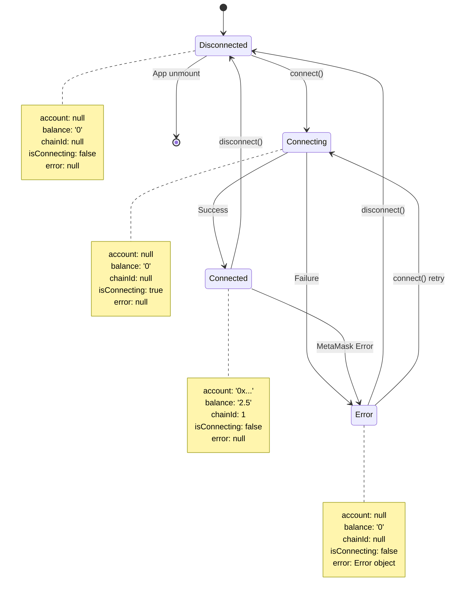

# State Machine: Wallet Connection States

> Диаграмма состояний подключения кошелька

**Тип:** State Machine Diagram

**Компонент:** WalletService

**Назначение:** Описывает все возможные состояния подключения и переходы между ними

---

## Диаграмма



---

## Описание состояний

### Disconnected (Начальное состояние)

**Описание:**

Кошелек не подключен. Это состояние по умолчанию при загрузке приложения или после отключения.

**WalletState:**

```typescript
{
  account: null,
  balance: '0',
  chainId: null,
  isConnecting: false,
  error: null
}
```

**UI:**

- Показывается кнопка "Connect Wallet"
- Нет информации о кошельке
- Форма отправки транзакций недоступна

**Возможные переходы:**

- ✅ `connect()` → **Connecting**
- ✅ App unmount → **[*]** (конец)

---

### Connecting (Промежуточное состояние)

**Описание:**

Процесс подключения к MetaMask в процессе. Ожидается взаимодействие с пользователем.

**WalletState:**

```typescript
{
  account: null,
  balance: '0',
  chainId: null,
  isConnecting: true,  // ключевое отличие
  error: null
}
```

**UI:**

- Кнопка "Connect Wallet" disabled
- Показывается loading спиннер
- Текст: "Connecting..." или "Waiting for MetaMask..."

**Действия в процессе:**

1. Запрос к `window.ethereum.request({method: 'eth_requestAccounts'})`
2. MetaMask показывает popup
3. Пользователь подтверждает или отклоняет
4. Получение баланса и сети

**Возможные переходы:**

- ✅ Success (user approved) → **Connected**
- ❌ Failure (user rejected, network error) → **Error**

**Время в состоянии:**

- Минимум: ~500ms (быстрое подтверждение)
- Максимум: ~30s (timeout или медленный пользователь)

---

### Connected (Целевое состояние)

**Описание:**

Кошелек успешно подключен. Пользователь может просматривать баланс и отправлять транзакции.

**WalletState:**

```typescript
{
  account: '0x742d35Cc6634C0532925a3b844Bc9e7595f0bEb',
  balance: '2.5',  // ETH
  chainId: 1,  // Ethereum Mainnet
  isConnecting: false,
  error: null
}
```

**UI:**

- Отображается информация о кошельке:
  - Адрес (сокращенный)
  - Баланс
  - Сеть
- Кнопка "Disconnect"
- Форма отправки транзакций доступна

**Event Listeners активны:**

```typescript
window.ethereum.on('accountsChanged', handleAccountsChanged)
window.ethereum.on('chainChanged', handleChainChanged)
```

**Возможные переходы:**

- ✅ `disconnect()` → **Disconnected**
- ❌ MetaMask Error (account locked, network error) → **Error**
- ℹ️ `accountsChanged` → **Connected** (обновление аккаунта)
- ℹ️ `chainChanged` → **Connected** (обновление сети)

---

### Error (Ошибочное состояние)

**Описание:**

Произошла ошибка при подключении или во время работы. Кошелек недоступен.

**WalletState:**

```typescript
{
  account: null,
  balance: '0',
  chainId: null,
  isConnecting: false,
  error: Error('User rejected the request.')  // пример
}
```

**Типы ошибок:**

1. **User Rejection (code 4001):**
   - Пользователь отклонил запрос в MetaMask
   - Сообщение: "Connection rejected by user"

2. **MetaMask Not Installed:**
   - `window.ethereum` не найден
   - Сообщение: "Please install MetaMask"

3. **Network Error:**
   - RPC провайдер недоступен
   - Сообщение: "Network unavailable"

4. **Account Locked:**
   - MetaMask залочен
   - Сообщение: "Please unlock MetaMask"

**UI:**

- Показывается сообщение об ошибке
- Кнопка "Try Again" (вызывает `connect()`)
- Или кнопка "Dismiss" (вызывает `disconnect()` для сброса состояния)

**Возможные переходы:**

- ✅ `connect()` → **Connecting** (retry)
- ✅ `disconnect()` → **Disconnected** (clear error)

---

## Переходы между состояниями

### Disconnected → Connecting

**Триггер:** `WalletService.connect()` вызван

**Условие:** Нет (всегда возможен)

**Действия:**

1. Установить `isConnecting = true`
2. Вызвать `notify()` подписчиков
3. Запросить доступ к MetaMask

**Код:**

```typescript
async connect() {
  this.state = {
    ...this.state,
    isConnecting: true,
    error: null
  }
  this.notify()

  // ... запрос к MetaMask
}
```

---

### Connecting → Connected

**Триггер:** Успешное получение аккаунта, баланса и сети

**Условие:** Пользователь подтвердил запрос в MetaMask

**Действия:**

1. Сохранить `account`, `balance`, `chainId`
2. Установить `isConnecting = false`
3. Установить event listeners
4. Вызвать `notify()` подписчиков

**Код:**

```typescript
const accounts = await window.ethereum.request({
  method: 'eth_requestAccounts'
})

const balance = await this.provider.getBalance(accounts[0])
const network = await this.provider.getNetwork()

this.state = {
  account: accounts[0],
  balance: formatEther(balance),
  chainId: Number(network.chainId),
  isConnecting: false,
  error: null
}
this.notify()
```

---

### Connecting → Error

**Триггер:** Ошибка при подключении

**Условие:** Любая из:

- Пользователь отклонил запрос
- MetaMask не установлен
- Network timeout
- Unexpected error

**Действия:**

1. Сохранить error object
2. Установить `isConnecting = false`
3. Вызвать `notify()` подписчиков

**Код:**

```typescript
try {
  // ... попытка подключения
} catch (error) {
  this.state = {
    ...this.state,
    isConnecting: false,
    error: error as Error
  }
  this.notify()
}
```

---

### Connected → Disconnected

**Триггер:** `WalletService.disconnect()` вызван

**Условие:** Нет (всегда возможен из Connected)

**Действия:**

1. Очистить все поля состояния
2. Удалить event listeners
3. Вызвать `notify()` подписчиков

**Код:**

```typescript
disconnect() {
  // Удаляем listeners
  if (window.ethereum) {
    window.ethereum.removeListener('accountsChanged', this.handleAccountsChanged)
    window.ethereum.removeListener('chainChanged', this.handleChainChanged)
  }

  // Сбрасываем состояние
  this.state = {
    account: null,
    balance: '0',
    chainId: null,
    isConnecting: false,
    error: null
  }

  this.provider = null
  this.signer = null

  this.notify()
}
```

---

### Connected → Error

**Триггер:** Ошибка во время работы

**Условие:** Любая из:

- MetaMask залочен пользователем
- Сеть недоступна
- Unexpected error

**Действия:**

1. Сохранить error
2. Очистить account, balance, chainId
3. Вызвать `notify()` подписчиков

**Примеры событий:**

- User locks MetaMask
- Network disconnects
- RPC provider fails

---

### Error → Disconnected

**Триггер:** `WalletService.disconnect()` вызван (clear error)

**Условие:** Пользователь хочет сбросить ошибку

**Действия:**

1. Очистить error
2. Сбросить все поля в начальное состояние
3. Вызвать `notify()` подписчиков

---

### Error → Connecting

**Триггер:** `WalletService.connect()` вызван (retry)

**Условие:** Пользователь хочет повторить подключение

**Действия:**

1. Очистить error
2. Установить `isConnecting = true`
3. Повторить процесс подключения

---

## События MetaMask

### accountsChanged

**Описание:** Пользователь сменил аккаунт в MetaMask

**Текущее состояние:** Connected

**Действие:**

```typescript
handleAccountsChanged(accounts: string[]) {
  if (accounts.length === 0) {
    // Пользователь отключил все аккаунты
    this.disconnect()
  } else {
    // Обновляем аккаунт и баланс
    this.state.account = accounts[0]
    this.updateBalance()
    this.notify()
  }
}
```

**Результат:** Остается в **Connected**, но с новым аккаунтом

---

### chainChanged

**Описание:** Пользователь сменил сеть в MetaMask

**Текущее состояние:** Connected

**Действие:**

```typescript
handleChainChanged(chainId: string) {
  // Обновляем chainId и баланс
  this.state.chainId = Number(chainId)
  this.updateBalance()  // баланс может отличаться в разных сетях
  this.notify()
}
```

**Результат:** Остается в **Connected**, но с новым chainId

---

## Инварианты

Правила, которые всегда должны соблюдаться:

### Правило 1: В любой момент времени только одно состояние активно

Система всегда находится ровно в одном из четырех состояний: Disconnected, Connecting, Connected, Error.

### Правило 2: isConnecting === true ТОЛЬКО в состоянии Connecting

```typescript
if (state.isConnecting) {
  // MUST BE in Connecting state
  assert(currentState === 'Connecting')
}
```

### Правило 3: account !== null ТОЛЬКО в состоянии Connected

```typescript
if (state.account !== null) {
  // MUST BE in Connected state
  assert(currentState === 'Connected')
}
```

### Правило 4: error !== null ТОЛЬКО в состоянии Error

```typescript
if (state.error !== null) {
  // MUST BE in Error state
  assert(currentState === 'Error')
}
```

### Правило 5: В Connected ВСЕГДА есть account, balance, chainId

```typescript
if (currentState === 'Connected') {
  assert(state.account !== null)
  assert(state.chainId !== null)
  assert(state.balance !== '0' || true)  // баланс может быть 0
}
```

---

## Тестирование состояний

### Unit Tests

```typescript
describe('WalletService State Machine', () => {
  it('starts in Disconnected state', () => {
    const service = new WalletService()
    expect(service.getState()).toMatchObject({
      account: null,
      isConnecting: false,
      error: null
    })
  })

  it('transitions to Connecting on connect()', async () => {
    const service = new WalletService()
    const promise = service.connect()

    // Сразу после вызова должно быть Connecting
    expect(service.getState().isConnecting).toBe(true)
  })

  it('transitions to Connected on success', async () => {
    const service = new WalletService()
    await service.connect()

    expect(service.getState()).toMatchObject({
      account: expect.stringMatching(/^0x/),
      isConnecting: false,
      error: null
    })
  })

  it('transitions to Error on rejection', async () => {
    const service = new WalletService()
    // Mock user rejection
    window.ethereum.request = jest.fn().mockRejectedValue(
      { code: 4001 }
    )

    await expect(service.connect()).rejects.toThrow()
    expect(service.getState().error).not.toBeNull()
  })

  it('returns to Disconnected on disconnect()', () => {
    const service = new WalletService()
    // assume connected
    service.disconnect()

    expect(service.getState()).toMatchObject({
      account: null,
      isConnecting: false,
      error: null
    })
  })
})
```

---

## Связанные диаграммы

**Sequence Diagrams:**

- 📄 [Connect Wallet Flow](../sequences/connect-wallet-flow.md) - Детальный поток подключения

**C4 Diagrams:**

- 📄 [Level 4: Code Diagram](../c4-diagrams/level-4-code.md) - WalletService реализация

**Другие State Machines:**

- 📄 [Transaction States](./transaction-states.md) - Состояния транзакций

**Назад:**

- 📄 [Architecture README](../README.md)

---

**Последнее обновление:** 2025-10-19

**Автор:** Architecture Team

**Статус:** ✅ Актуально
